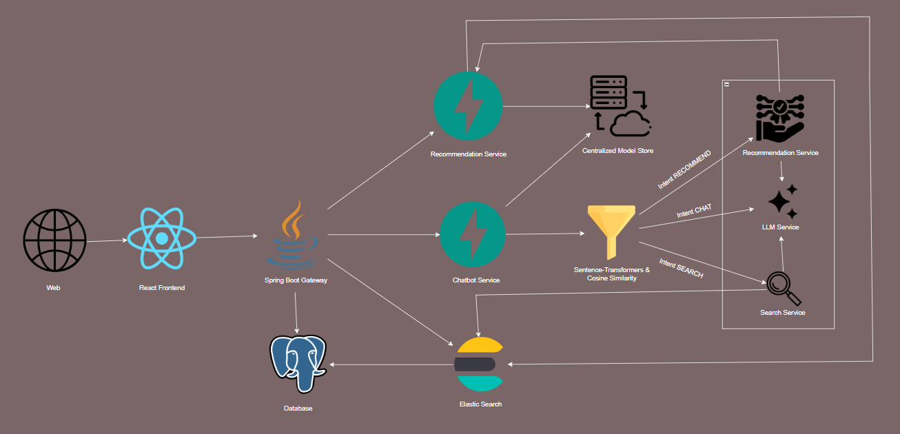
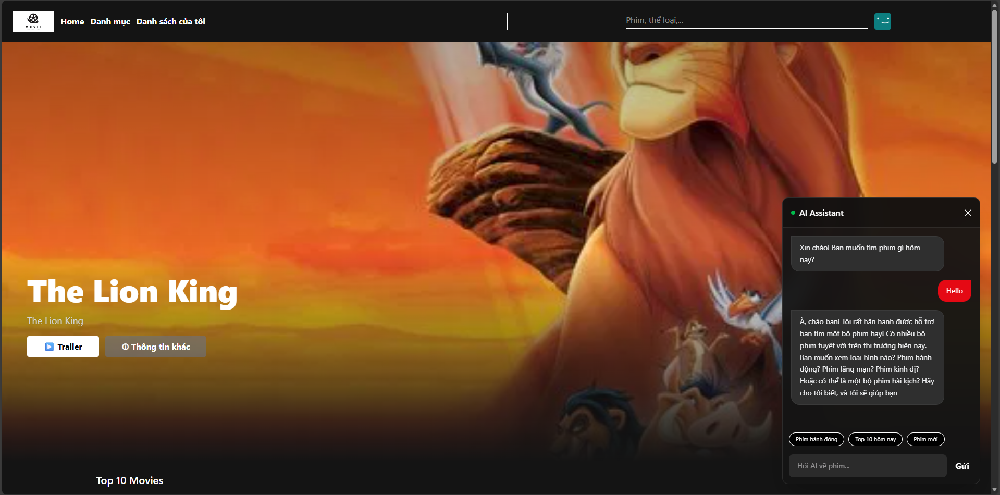
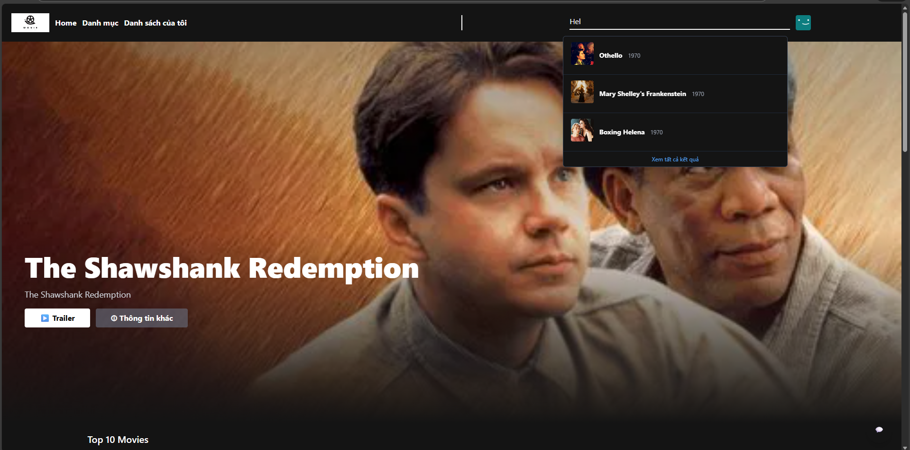
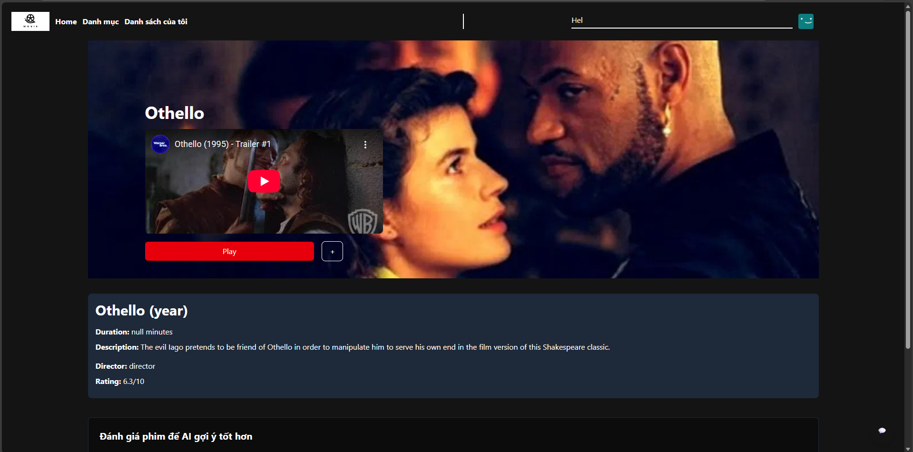
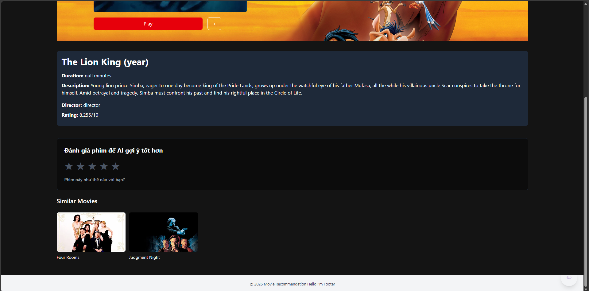
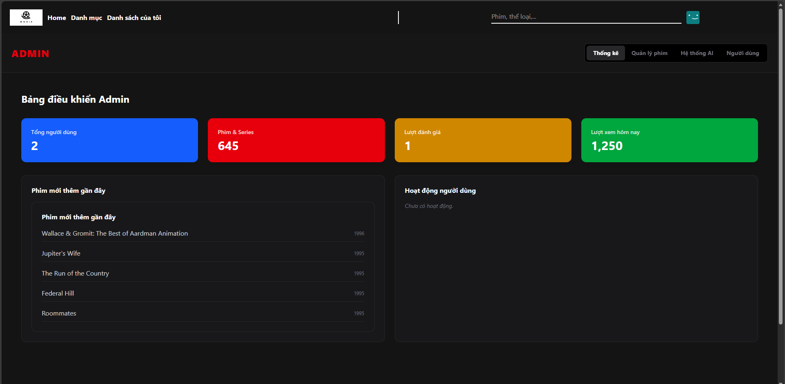

# Movie Recommendation System
An advanced, end-to-end movie recommendation ecosystem that leverages the power of Generative AI, Semantic Search, and Hybrid Filtering. This project demonstrates a production-grade architecture combining Java's robustness with Python's AI capabilities.

# System Architecture


# Project Gallery
|  |  |
|:---:|:---:|
|  |  |
|  |  |
|:---:|:---:|
|  |  |
|  |  |
|:---:|:---:|
|  |  |
|  |  |
|:---:|:---:|
|  | |

# Getting Started

## Prerequisites
* Docker & Docker Compose (Recommended)

* Java 21 & Maven

* Python 3.11

* Node.js & NPM

## 1. Clone the Repository

```bash
git clone https://github.com/DoVanMinhTai/movie-recommendation.git
cd movie-recommendation
```

## 2. Clone the Repository
For security reasons, sensitive keys such as TMDB API tokens and Database credentials are not included in the repository.
A valid .env file is required to run this project. 
Please contact the author to obtain the configuration template and necessary keys:
> Author: Do Van Minh Tai
>
> Email: dotai05678910@gmail.com

## 3.Execution
Run the entire stack using Docker:

```bash
docker-compose up -d
```
